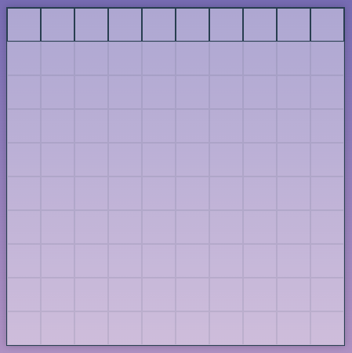
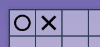
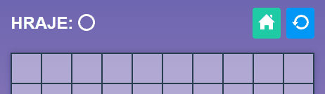
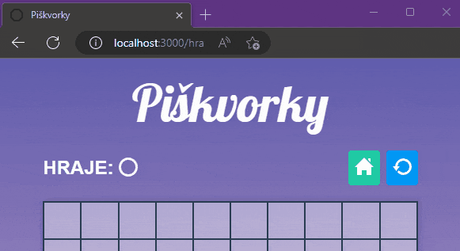
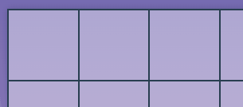

# Úkol: Piškvorky 3/5

Tento úkol navazuje na [Piškvorky 2](https://github.com/Czechitas-podklady-WEB/Ukol-Piskvorky-2). Čeká tě oživění prvních pár políček a volitelně i vylepšení tlačítka pro restart hry.

## Zadání

1.  Pokračuj v repozitáři `piskvorky` z předchozích úkolů.

1.  Vytvoř a napoj do stránky `hra.html` javascriptový soubor `hra.js`.

1.  V několika dalších krocích budeš oživovat pouze první řádek herní plochy, prvních deset políček. Zbylých 90 políček budeš oživovat až v dalších úkolech. Až po tom, co si v lekcích ukážeme další javascriptové vychytávky.

    

1.  Zařiď, aby klikáním na políčka se v nich objevovaly kolečka a křížky a v levé části nad herní plochou se zobrazovala informace o tom, kdo je na tahu. Co budeš potřebovat:

    - Nachystej si dvě CSS třídy (například `board__field--circle` a `board__field--cross`), které políčko dostylují tak, aby se na něm zobrazilo kolečko nebo křížek. Neboj se třídy otestovat tak, že je na zkoušku přidáš tlačítkům přímo v HTML. Po testu je z HTML nezapomeň smazat, protože tyto třídy bude přidávat a odebírat pouze javascript.

      

      - Lehčí varianta: Stáhni si ikonky [circle.svg](https://github.com/Czechitas-podklady-WEB/Ukol-Piskvorky-3/raw/main/podklady/circle.svg) a [cross.svg](https://github.com/Czechitas-podklady-WEB/Ukol-Piskvorky-3/raw/main/podklady/cross.svg) a použij je jako pozadí políčka (`background-image`).

      - Těžší (bonusová) varianta: Vytvoř si kolečka a křížky pomocí CSS pseudopvků.

    - V javascriptu si nachystej proměnnou, která bude obsahovat informaci o tom, kdo je na tahu. Například `let currentPlayer = 'circle'`, protože hru začíná kolečko.

    - Všem deseti tlačítkům přidej posluchač události na kliknutí.

      - V selektorech si můžeš pomoct pseudotřídou `nth-child`. Například `document.querySelector('button:nth-child(5)')` vybere páté tlačítko (za předpokladu, že prvky `<button>` máš pouze v herní ploše). `document.querySelector('button:nth-child(6)')` vybere šesté, atd.

    - Vytvoř funkci pro posluchač, která políčku, na které uživatel kliknul (`event.target`), přidá příslušnou třídu. (Pro zjednodušení zkus přidávat nejdříve jen kolečka.)

      

      

    - S každým kliknutím změň hodnotu proměnné `currentPlayer` na opačnou. Z `circle` na `cross` a naopak.

    - Podle hotnoty proměnné na stránce uprav znázornění, kdo právě hraje.

      

    - Zamez, aby uživatel mohl na již zahraná políčka kliknout vícekrát pomocí vlastnosti `disabled` (`event.target.disabled = true`).

      

      

## Bonus

- Může se stát, že uživatel se omylem uklikne a tlačítkem pro restart přijde o rozehranou hru. Proto přidej odkazu, tomu modrému, posluchač události, který se po kliknutí uživatele zeptá zabudovanou funcí `confirm`, jestli chce hru opravdu restartovat. Pokud ne, zavolej `event.preventDefault()` a tak zabráníš odkazu, aby se provedl. Funkce `confirm` vrací `true` nebo `false` podle toho, zda uživatel potvrdil nebo zrušil dialog.

  

- Pomocí animací přidej symbolům efekt postupného zvětšení. V náhledu je animace zpomalená z času `0.15s` na `0.45s`, aby bylo lépe vidět, jak má vypadat. V tvém kódu po otestování použij čas kratší, aby hra působila svižně.

  
